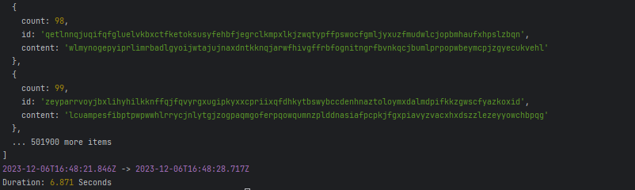
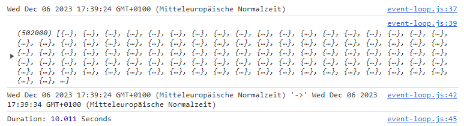

# Performance Comparison
To compare performance differences between browser and node runtime, the JavaScript
event loop is used. 

Runtime duration is printed out in seconds.

## Node.js
Run 
```bash
node event-loop.js
```

**Result**:


## Browser
Open
```bash
./event-loop.html
```
in your favorite browser and enable Dev Tools console to see output.

**Result**:

